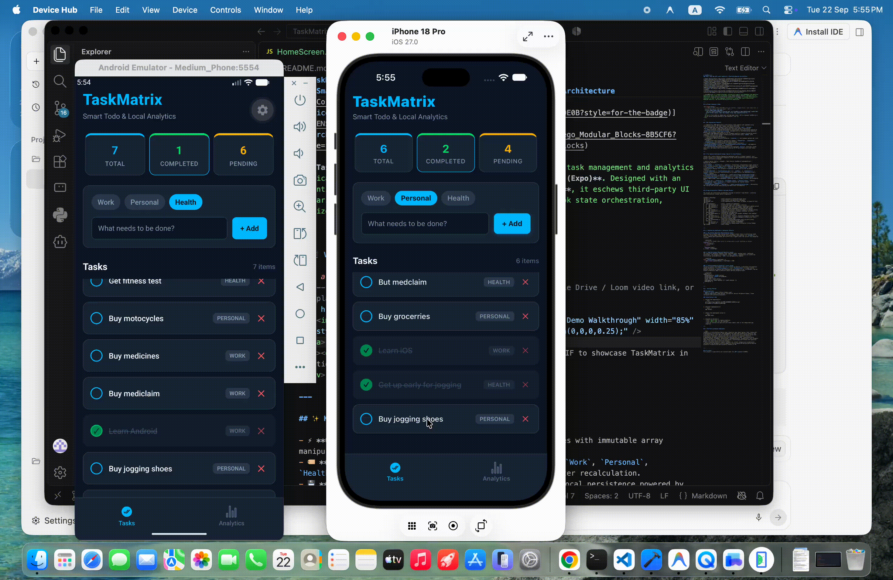

# TaskMatrix ⚡
### Smart Todo App with Local Analytics & Platform-Adaptive Architecture

[](https://reactnative.dev/)
[](https://expo.dev/)
[](https://react.dev/)
[](#)
[](LICENSE)
[](#-lego-architecture-modular-building-blocks)

> **TaskMatrix** is a production-grade, offline-first mobile task management and analytics application built from first principles using **React Native (Expo)**. Designed with an intentional **Android-to-Cross-Platform architectural bridge**, it eschews third-party UI libraries in favor of pure component architecture, custom hook state orchestration, memoized analytics, and native-feeling platform adaptations.

---

## 📱 Visual Showcase & Demo

<div align="center">
  <!-- Replace DEMO_VIDEO_LINK_HERE with your YouTube / Google Drive / Loom video link, or replace the img src with your asset / GIF -->
  <a href="DEMO_VIDEO_LINK_HERE">
    
  </a>
  <p><em>🎥 Click above or embed your recorded demo video / GIF to showcase TaskMatrix in action across Android Emulator & iOS Simulator.</em></p>
</div>

---

## ✨ Key Engineering Features

- ⚡ **Optimistic CRUD Operations:** Zero-latency state updates with immutable array manipulation patterns for add, toggle, and delete workflows.
- 🏷️ **Categorized Task Streams:** Multi-category filtering (`Work`, `Personal`, `Health`) with dynamic badge highlighting and real-time counter recalculation.
- 💾 **Race-Condition Protected Persistence:** Asynchronous local persistence powered by `@react-native-async-storage/async-storage` equipped with an **initialization hydration guard** that prevents state wipes on startup.
- 📊 **Real-Time Memoized Analytics:** An in-memory analytics engine calculating overall completion rates and per-category productivity distributions using `useMemo` with arithmetic zero-division guards.
- 🎨 **Platform-Adaptive UI Design:**
  - **Android:** Native Material elevation (`elevation: 4`) and hardware gesture bar inset adjustments.
  - **iOS:** Soft multi-property layered drop shadows (`shadowOffset`, `shadowRadius`, `shadowOpacity`) and dynamic notch safe-area handling.
- ⌨️ **Fluid Keyboard & Scrolling UX:** Seamless scroll-to-dismiss (`keyboardDismissMode="on-drag"`), `keyboardShouldPersistTaps="handled"`, and adaptive `KeyboardAvoidingView` offsets across platforms.
- 🗂️ **Virtualised Performance:** Rendered with optimized `FlatList` recycling, custom separators, and empty-state placeholders ensuring 60 FPS performance even under heavy lists.

---

## 🌉 The Android Developer’s Bridge: Native to Cross-Platform

Coming from a native Android engineering background (Kotlin & Jetpack Compose), this project served as an intentional blueprint to map native architecture patterns into React Native's declarative paradigm:

| Android Native (Kotlin / Jetpack) | React Native (TaskMatrix Implementation) | Engineering Rationale |
|---|---|---|
| **`ViewModel` + `StateFlow`** | `useTodos()` Custom Hook | Encapsulates single source of truth, isolates business logic from UI rendering, and provides clean state subscriptions. |
| **`RecyclerView` + `ListAdapter`** | `<FlatList />` with `keyExtractor` | Windowed list virtualization reusing view instances to maintain 60 FPS scrolling and low memory footprint. |
| **`derivedStateOf` / `Transformations.map()`** | `useMemo()` in `useAnalytics()` | Prevents costly statistical recalculations on re-renders unless the dependency array (`[todos]`) mutates. |
| **`SharedPreferences` / `DataStore`** | `@react-native-async-storage/async-storage` | Asynchronous key-value persistence layer with an explicit JSON serialization wrapper. |
| **`WindowInsetsCompat` / `fitsSystemWindows`** | `react-native-safe-area-context` | Dynamic edge-to-edge layout management respecting notches, Dynamic Islands, and navigation bars. |
| **`styles.xml` / `elevation`** | `StyleSheet.create` + `Platform.select` | Android native material depth (`elevation: 4`) mapped alongside iOS layered shadows (`shadowOffset`, `shadowRadius`). |
| **`BottomNavigationView` + `NavGraph`** | `@react-navigation/bottom-tabs` | Declarative tab routing with unified state passing and UIKit-style tab behaviors. |

---

## 🧱 Lego Architecture (Modular Building Blocks)

The project was constructed incrementally through 11 distinct "Lego Blocks", isolating each architectural concept before integration:

```
TaskMatrix_ReactApp/
├── App.js                   # Root Component & SafeAreaProvider Setup
├── app.json                 # Expo Project Configuration & Metadata
├── package.json             # Core Dependencies (Zero bloat: no Redux, no heavy UI libs)
├── src/
│   ├── components/          # Pure, reusable UI components
│   │   ├── TodoInput.js     # Controlled input with category selection
│   │   ├── TodoItem.js      # Individual task card with status transitions & delete action
│   │   └── StatCard.js      # Adaptive metric tile with dynamic highlight colors
│   ├── hooks/               # Decoupled state management & computational engines
│   │   ├── useTodos.js      # Central CRUD actions, optimistic updates & storage syncing
│   │   └── useAnalytics.js  # Memoized performance & category breakdown calculator
│   ├── navigator/           # Navigation configuration
│   │   └── AppNavigator.js  # Bottom tab navigator with dynamic hardware inset padding
│   ├── screens/             # Top-level screen views
│   │   ├── HomeScreen.js    # Task dashboard, FlatList, keyboard management & empty states
│   │   └── AnalyticsScreen.js# Progress bars, category breakdown & productivity charts
│   ├── storage/             # Data persistence layer
│   │   └── asyncStorage.js  # Resilient AsyncStorage wrapper with try-catch safety
│   └── utils/               # Constants & platform styling helpers
│       ├── constants.js     # Design tokens (COLORS, CATEGORIES)
│       └── shadows.js       # Cross-platform shadow engine (Elevation vs Drop Shadow)
└── LICENSE                  # MIT License
```

---

## 🛡️ Engineering Highlights & Defensive Patterns

### 1. The Startup Hydration Race-Condition Guard
A common flaw in mobile apps syncing local storage to React state is overwriting saved data with initial empty state before the asynchronous read resolves. In `useTodos.js`, a strict loading guard guarantees persistence only triggers after the initial disk hydration finishes:

```javascript
// 🛡️ CRITICAL GUARD: Never write to storage while initial hydration is active!
useEffect(() => {
  if (isLoading) {
    return;
  }
  saveTodos(todos);
}, [todos, isLoading]);
```

### 2. High-Performance Memoized Analytics Engine
The statistics dashboard computes total completed tasks, pending tasks, completion percentages, and category distributions. Using `useMemo`, computations are cached and zero-division vulnerabilities (`NaN%`) are mathematically handled:

```javascript
const completionRate = totalTodos > 0 
  ? Math.round((completedTodos / totalTodos) * 100) 
  : 0;
```

### 3. Platform-Adaptive Elevation & Inset Tuning
Instead of generic box-shadows that fail silently on Android, a dedicated cross-platform shadow abstraction (`src/utils/shadows.js`) uses `Platform.select` to render native Material elevation on Android and CoreAnimation drop-shadows on iOS. Furthermore, tab bar heights dynamically adapt to physical device gesture navigation bars:

```javascript
tabBarStyle: {
  backgroundColor: COLORS.surface,
  borderTopColor: COLORS.surfaceBorder,
  borderTopWidth: 1,
  height: 60 + insets.bottom,
  paddingBottom: insets.bottom > 0 ? insets.bottom : 8,
  paddingTop: 8,
}
```

---

## 🚀 Getting Started

### Prerequisites
- [Node.js (v18 or newer)](https://nodejs.org/)
- [Expo Go app](https://expo.dev/go) (on physical device) OR Android Studio / Xcode configured with emulators/simulators.

### Installation & Run

1. **Clone the repository:**
   ```bash
   git clone https://github.com/YOUR_USERNAME/TaskMatrix.git
   cd TaskMatrix/TaskMatrix_ReactApp
   ```

2. **Install dependencies:**
   ```bash
   npm install
   ```

3. **Start the development server:**
   ```bash
   npx expo start
   ```

4. **Launch on devices:**
   - Press <kbd>a</kbd> for Android Emulator.
   - Press <kbd>i</kbd> for iOS Simulator.
   - Scan the terminal QR code with your phone camera (iOS) or the **Expo Go** app (Android).

---

## 💼 Portfolio & Resume Highlights

```text
TaskMatrix — Cross-Platform Mobile Todo & Analytics App (React Native, Expo, JavaScript)
• Engineered an offline-first task management and real-time productivity analytics app using React Native (Expo SDK 57) and React 19, architected with a decoupled custom hook architecture (useTodos, useAnalytics) and zero external UI component libraries.
• Implemented an Android-to-Cross-Platform architectural bridge, translating native Android concepts (ViewModel, RecyclerView, SharedPreferences, WindowInsets) into idiomatic React Native patterns (FlatList virtualization, AsyncStorage persistence with hydration guards, and react-native-safe-area-context).
• Built a memoized analytics engine (useMemo) for instant category-wise productivity calculations and designed a platform-adaptive styling engine delivering native Material elevation on Android and multi-property shadows on iOS.
```

---

## 📄 License
This project is open-source and licensed under the [MIT License](LICENSE).
